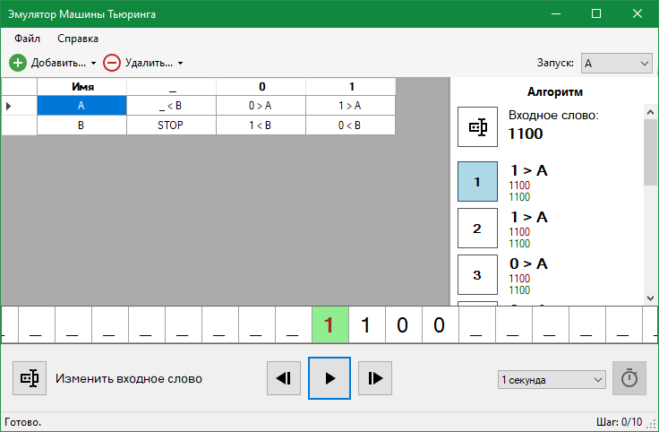

# Turing machines emulator
Written in C#, requires .NET Framework 4.7.1 to be installed.

Russian version only.

Created as a school project in Higher School of Economics, Software Engineering 2019-2020.